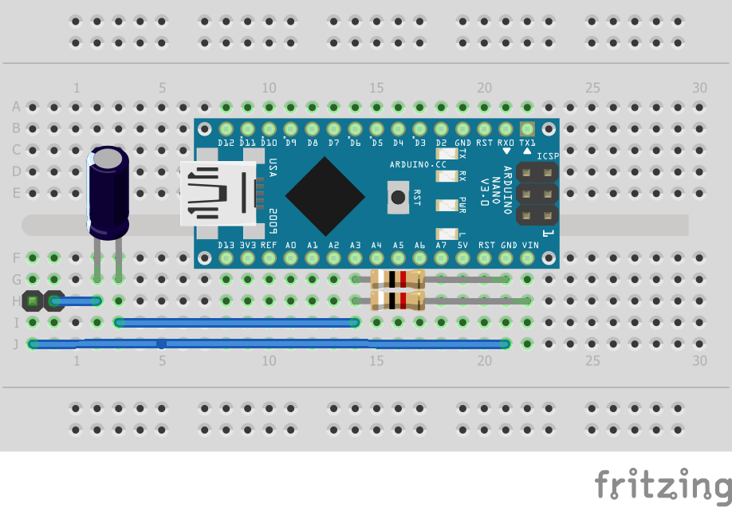
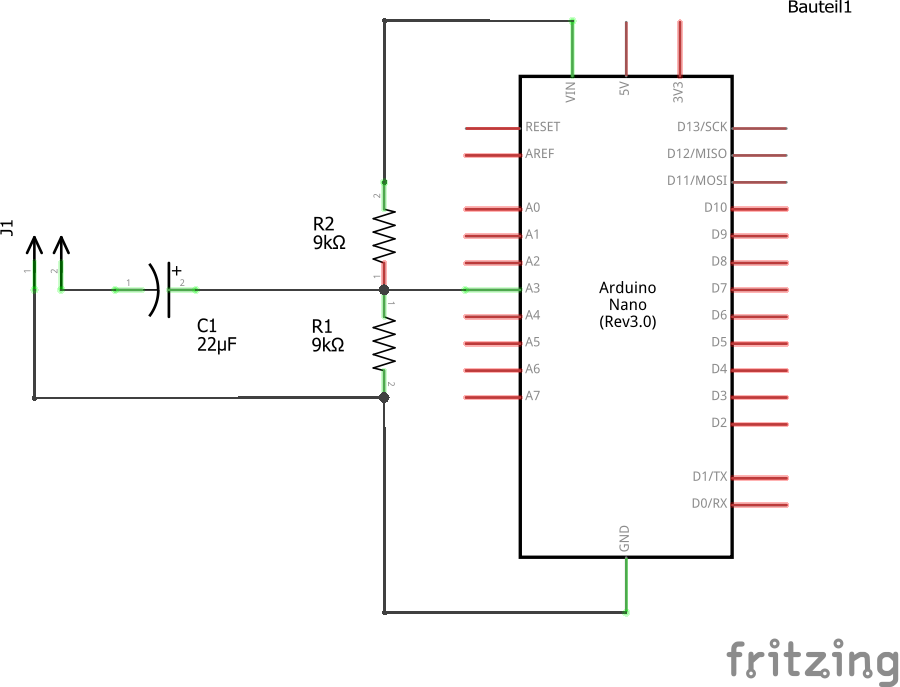

# ArduinoAdcAndFrequencyEstimation
A short example project on how to program an Ardunio for Analog to Digital Conversion and feed in data to a Jupyter notebook for frequency estimation

## Installation
* download python 3.6 [here](https://www.python.org/downloads/release/python-365/)
* create a virtual environment, e.g. by `virtualenv -p python3.6 [YourDesiredFolder]`

### Install required packages

#### A) Manually
  * `pip install jupyterlab`
  * `pip install pyserial`
  * `pip install numpy`
  * `pip install ipywidgets`
  * `pip install scipy`
  * `pip install bokeh`

#### B) Using provided requirements.txt
  * `pip install -r Python/requirements.txt`

### Install required Jupyter Lab Extensions
* `jupyter labextension install jupyterlab_bokeh`
* `jupyter labextension install @jupyter-widgets/jupyterlab-manager`

## Set Up Arduino
Build the following circuit with your Arduino Nano (or adapt to any other Arduino board).

Next upload the sketch `ADC_Stramer.ino` to your Arduino.
